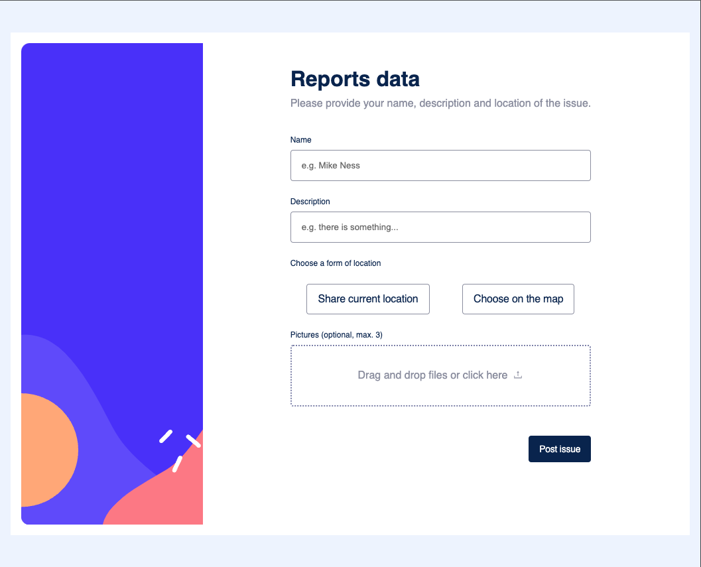
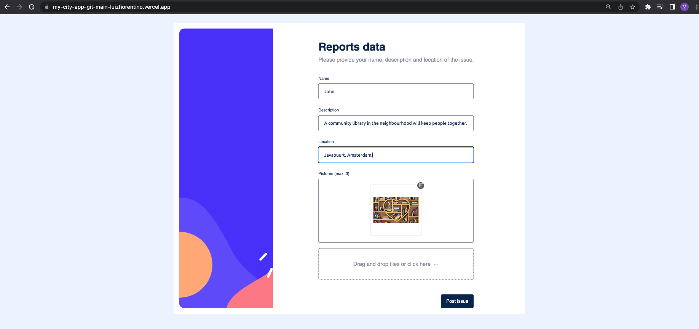
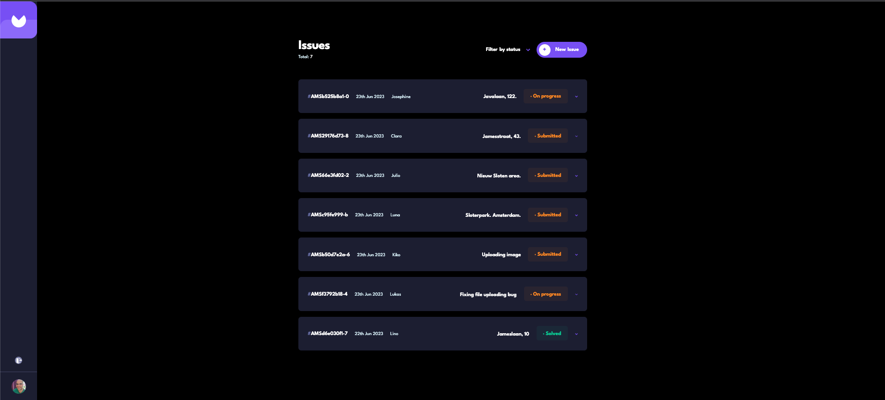
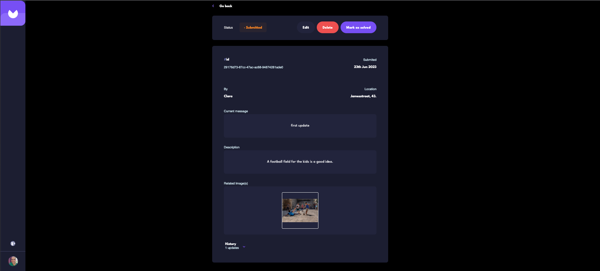
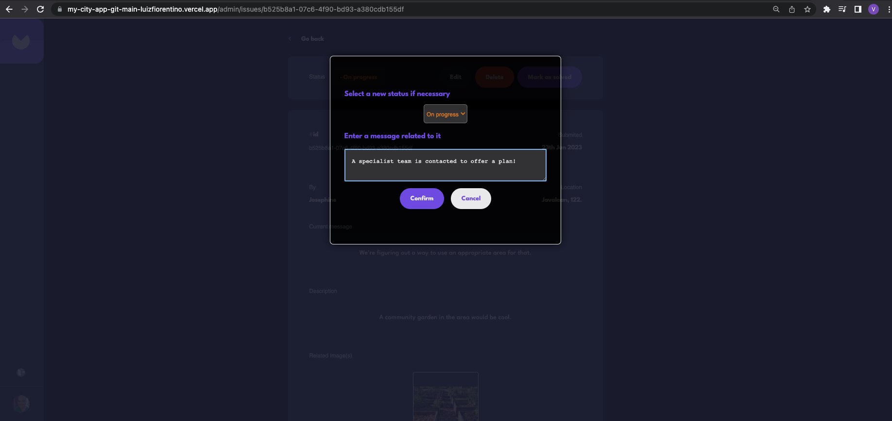

# My City App

Is there something in your city that needs to be fixed or could be improved? Through `My-City-App` users can connect with the Municipality, by filling in a form with their names, a description, the location, and even posting pictures of it! The Municipality, on the other hand, can have restricted access to these infos, add follow ups with status and message at each step until solving it, and to check out the history of all updates.

# [My City App](https://my-city-app-git-main-luizfiorentino.vercel.app/)

# [Demo Video: click here](https://share.getcloudapp.com/v1uWxA85#)

### My City App website with `Next.js`, `Prisma`, `PostgreSQL`, `Cloudinary`, `Next-Auth`, `React Dropzone`, `React-hook-form`, `Zod Schema validation`, `Multer Middleware`,`Nodemailer`, `Magic Link`, and `Figma Design`.

## Features


### Issue Submission Form

https://github.com/luizfiorentino/my-city-app/assets/96445830/34da685b-1c10-4186-a1f9-dd854c212777


- Built with `React-hook-form`
- Users type in name, description of the issue, and the location
- Related photos can be added (drag and drop) thanks to `React Dropzone`
- All the above fields are validated with `Zod schema validation`, providing the user feedback
- Image preview area with `base64` image previews
- `Remove button` for each selected image

### Admin Restricted Areas

- Built with `Next-Auth`, `Nodemailer` and `Magic Link`
- The access to `/admin` (list of submitted issues) and `/admin/issues/issueId` (Details Page) endpoints is only possible via login, entering an email address (that must be present in the database as admin)
- The admin gets a feedback to either check the informed email account or in case something went wrong (e.g. in case an invalid email address is provided)
- By opening the informed email account and clicking on the Magic Link, the admin is forwarded to the restricted area

### Admin List

- On the top of the page, the total amount of currently submitted issues is displayed, along with a `Filter by status` selector and an `Add New Issue` button
- The issues are displayed in summarized individual cards comprising its generated id, date of submission, user name, location, status, and a down arrow that when clicked, drops down the description provided by the user
- There is a Navbar with the App's icon, a `logout button` and the `admin's avatar`. It is placed on the very top of the screen in the mobile and tablet versions, and in the left side in the desktop one
- Clicking on the `status` button leads the admin to the correspondent `Details Page`

### Details Page

- The Navbar is also displayed here, as described in the item above
- There is a `Go back` button linking back to the `/admin` page (Admin List)
- `Edit Bar`: it shows the issue's current status, and three buttons: `Edit`- the admin can enter an update message and select a new status if necessary; `Delete`- the issue and all related info will be deleted after a warning message is displayed; and `Mark as solved`- the status will be automatically be selected as solved, and a correspondent message will be generated
- Only in the smaller screen version the Edit Bar is displayed underneath
- `Details Area`: shows the issue's id, date of submission, user who posted, location, the most recent update message (from the admin), the description and related image(s)
- `History Section`: informs the total of existing updates. Clicking the down arrow expands to display the past updates in cards, three at a time from newest to oldest, each containing the status, message, and date of the update
- To navigate through the next (or previous) group of inserted updates, use the numbered buttons bar

## The Challenge and Learning Goals

### How does this app work

- User Form Page(`/`): the user fills in the form with his/her name, description and location of the issue, and can optionally upload photos using the drag and drop feature (`React Dropzone`). It uses `React-hook-form` with `Zod schema validation` that either displays an error message in case one or more fields are not found valid or displays a success message if the issue is successfully submitted;
- An `image preview` feature displays the selected images, each of them with a button that removes it from both the preview and form ("file") arrays;
- The data is sent in the body of an `axios` request to the `/api/issues` route that uses `multer` middleware to update the images to `Cloudinary`, and then uses `prisma` to insert the data (including the image URLs) into the database.
- Admin Issues List Page(`/admin`): the admin must inform an email address that is already registered as such in the database. Using `Next-Auth` authentication, a `Magic Link` will be sent, and access will be granted to the page.
- This page uses `getServerSideProps()` function to fetch the data from the `PostgreSQL` database and display all posted issues with a card summarizing it with id, submission date, user name, address, current status, and an arrow down icon that when clicked expands the card and displays the description of the issue;
- When the user clicks on the status banner, the Details Page is opened.
- Details Page(`/admin/issues/issueId`): comprises all infos related to a specific issue- the ones mentioned above, plus the uploaded photo(s), the current (last) update message, and a History section that can be expanded to show all previous updates in cards containing status and message;
- There is also an Edit Bar with three buttons: "Edit", so the admin can change the current status if necessary, and add an update message; "Delete" that removes the issue from both the database and the Admin Issues List Page; and "Mark as solved" whereby the status will be automatically be set as "solved" and the correspondent update message will be added. The Edit Bar uses a modal that allows the edition with selector and text area ("Edit"), "Confirm" and "Cancel" buttons (all cases);
- To update an issue, an `axios` request to `/api/statusChanges` route is made with a body object containing "status", "message", and "issueId", so that a new status is inseted in the database. The "Delete" (but in this case a delete request is sent to `/api/issues/issueId`), and "Mark as solved" features work in a similar way.

### What did we achieve

- Great user experience: the app implements responsive `Figma design` in the user and admin interfaces (mobile, tablet and desktop screen versions) integrated with functionalities such as the drag and drop and image preview (for image upload), a general overview of all posted issues, a speciffic view of each of them in the Details Page, where every step taken by the Municipality can be described and later retrieved;
- Form validation and error handling give users accurate feedback (success or not) for every interaction (posting an issue, editing, deleting or marking it as solved);
- A seamless interlinkage between the `/api`'s Serverless Functions handlers and the database using `Prisma`'s operations (data is kept up to date);
- Using `NextAuth`for the admin pages provides security by ensuring that only authorized people has access to that info and can edit it;
- The app can expand or be changed keeping functionality and styling thanks to the reusable components roughtly divided in the "admin" and "user" folders, and more specifically organized in subfolders;
- Simplicity: the user story is approached with objectivity, e.g. the user form contains only essential elements, and the admin interface is clearly divided into a list of posted issues pointing to the details page in an intuitive way. Moreover, the admin actions are clearly set in the Edit Bar, so that all issues receive a same handling and understanding based in the history section.

### Design Preview: User Form



### Design Preview: Form filled in



### Design Preview: Admin List of Submitted Issues



### Design Preview: Admin Issue Details Page



### Design Preview: Admin Issue Edition



### Built with

- [Next.js](https://nextjs.org/)
- [React](https://reactjs.org/), [React-dom](https://reactjs.org/docs/react-dom.html)
- [Prisma](https://www.prisma.io)
- [PostgreSQL](https://www.postgresql.org)
- [Next-Auth](https://next-auth.js.org)
- [React-hook-form](https://react-hook-form.com)
- [Zod Validation Schema](https://zod.dev)
- [React Dropzone](https://react-dropzone.js.org)
- [Multer Middleware](https://expressjs.com/en/resources/middleware/multer.html)
- [Nodemailer](https://nodemailer.com/about/)
- [Magic Link](https://magic.link)
- [Cloudinary](https://cloudinary.com/)
- [Figma Design](https://www.figma.com)
- [CSS Styling](https://developer.mozilla.org/en-US/docs/Web/CSS), and [Flexbox](https://css-tricks.com/snippets/css/a-guide-to-flexbox/)

### Highlights of the Concepts and Techniques Applied

- Next.js: `getSserverSideProps()` function, `Next API Routes`, `NextAuth` combined with `PrismaClient` and `Email Provider`, `next/head` tag
- React: `useState`, `useEffect`, `useContext` hooks, callback props, reusable components
- Prisma: creating schema and migrations for a `PostgreSQL` databse
- Cloudinary: uploading images to an assigned folder
- CSS modules, and flexbox

### How to use this Repo

- Create a local folder and inside it type the following command: `git clone git@github.com:luizfiorentino/my-city-app.git`
- Install the dependencies with `npm install`
- Open another terminal screen to run the app: `npm run dev` (developers mode)
- Check out the `.env.example` file to accordingly setting up the database, cloudinary, Next-Auth, the SMTP, and Github

## Conclusion

- Try the different screen versions (mobile, tablet, desktop) by expanding/shrinking your browser's screen, explore both user and admin interfaces, e.g. by posting new issues and dragging one or more photos for each of them. Try file extensions other than ".jpeg", ".jpg", ".png", or files larger than 1MB, or uploading more than three files, and check the error messages for each of the cases
- In the admin interface, log in with an email address previously added to the database, use the sent Magic Link to get access, verify all issues posted are listed there. Click on one specific issue status and be forwarded to the Details Page
- In the Details Page, all user input (including uploaded photos) should be neatly displayed
- Use all the Edit Bar buttons to edit (select a new status, enter an update message), mark an issue as solved, and delete it (you will be redirected to the admin list in the latter case)
- Add several updates using the edit button and then explore the History Section by expanding it and clicking the numbered buttons bar to see all cards with status, message and date of insertion

## Next.js Documentation:

This is a [Next.js](https://nextjs.org/) project bootstrapped with [`create-next-app`](https://github.com/vercel/next.js/tree/canary/packages/create-next-app).

### Getting Started

First, run the development server:

```bash
npm run dev
# or
yarn dev
# or
pnpm dev
```

Open [http://localhost:3000](http://localhost:3000) with your browser to see the result.

You can start editing the page by modifying `pages/index.js`. The page auto-updates as you edit the file.

[API routes](https://nextjs.org/docs/api-routes/introduction) can be accessed on [http://localhost:3000/api/hello](http://localhost:3000/api/hello). This endpoint can be edited in `pages/api/hello.js`.

The `pages/api` directory is mapped to `/api/*`. Files in this directory are treated as [API routes](https://nextjs.org/docs/api-routes/introduction) instead of React pages.

This project uses [`next/font`](https://nextjs.org/docs/basic-features/font-optimization) to automatically optimize and load Inter, a custom Google Font.

## Learn More

To learn more about Next.js, take a look at the following resources:

- [Next.js Documentation](https://nextjs.org/docs) - learn about Next.js features and API.
- [Learn Next.js](https://nextjs.org/learn) - an interactive Next.js tutorial.

You can check out [the Next.js GitHub repository](https://github.com/vercel/next.js/) - your feedback and contributions are welcome!

## Deploy on Vercel

The easiest way to deploy your Next.js app is to use the [Vercel Platform](https://vercel.com/new?utm_medium=default-template&filter=next.js&utm_source=create-next-app&utm_campaign=create-next-app-readme) from the creators of Next.js.

Check out our [Next.js deployment documentation](https://nextjs.org/docs/deployment) for more details.
